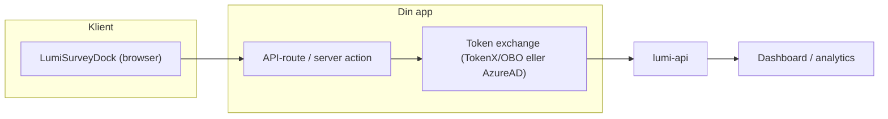

# Lumi

Monorepo for Lumi survey analytics.

Lumi består av:

- **Survey widget**: React-widget som brukes i flater for å samle inn tilbakemeldinger.
- **API**: Tar imot submissions, lagrer data, og tilbyr analytics/endepunkter for dashboard.
- **Dashboard**: Admin-grensesnitt for å utforske data, filtrere, tagge og eksportere.

## Kom i gang med survey (lumi-survey)

Dette er korteste vei til første survey (rating/smiley). Full guide og API-referanse ligger i
[`packages/lumi-survey/README.md`](packages/lumi-survey/README.md).

```tsx
import "@navikt/ds-css";
import "@navikt/lumi-survey/styles.css";

import { LumiSurveyDock } from "@navikt/lumi-survey";

const survey = {
  type: "rating",
  questions: [
    {
      id: "rating",
      type: "rating",
      prompt: "Hvordan var opplevelsen?",
      variant: "emoji",
      required: true,
    },
  ],
};

const transport = {
  async submit(submission) {
    await fetch("/api/lumi/feedback", {
      method: "POST",
      headers: { "content-type": "application/json" },
      body: JSON.stringify(submission.transportPayload),
    });
  },
};

export function App() {
  return (
    <LumiSurveyDock
      surveyId="my-app-feedback"
      survey={survey}
      transport={transport}
    />
  );
}
```

Viktig: Widgeten skal **ikke** poste direkte til `lumi-api` fra browser. Se transportflyten under.

## Velg surveytype (kortversjon)

Start enkelt (ofte `rating`). Full playbook (valg av surveytype, best practices og go-live) ligger i
[`packages/lumi-survey/README.md`](packages/lumi-survey/README.md).

## Arkitektur (1 minutt)



## Dokumentasjon

- Survey widget: [`packages/lumi-survey/README.md`](packages/lumi-survey/README.md)
- API og tilgang: [`apps/lumi-api/README.md`](apps/lumi-api/README.md)

## Struktur
- `apps/lumi-dashboard`: Admin-dashboard (TanStack Start)
- `apps/lumi-api`: Backend-API (Kotlin/Ktor)
- `packages/lumi-types`: Delte TypeScript-typer
- `packages/lumi-survey`: Survey-widget

## Integrasjon og tilgang (for team)

Lumi skiller bevisst mellom submissions fra sluttbruker-flater (TokenX) og veileder/fagsystemer (AzureAD). Dette gjør feilsøking enklere og unngår at vi må "gjette" issuer.

Viktig: Survey-widgeten skal **ikke** poste direkte til `lumi-api` fra browser. Token exchange må gjøres server-side. Typisk flyt er:

1. Widget sender payload til din app/backend (f.eks. server action / API-route)
2. Backend kan validere payload (valgfritt, men ofte lurt – f.eks. med Zod)
3. Backend gjør token exchange (TokenX/OBO eller AzureAD, avhengig av type flate)
4. Backend kaller `lumi-api`

### Slik integrerer du ("manuell" transport)

I NAV-økosystemet er det vanligst å implementere dette som en enkel server action / API-route i din app som:

1. Tar imot `submission.transportPayload` fra widgeten
2. (Valgfritt) validerer payload (f.eks. Zod)
3. Gjør token exchange og kaller `lumi-api`

Pseudo-kode (Next.js/Node-ish):

```ts
// 1) Client: widget transport
const transport = {
	async submit(submission) {
		await fetch("/api/lumi/feedback", {
			method: "POST",
			headers: { "content-type": "application/json" },
			body: JSON.stringify(submission.transportPayload),
		});
	},
};

// 2) Server: endepunkt som gjør token exchange + videresender
export async function POST(req: Request) {
	const payload = await req.json();

	// (Valgfritt) valider payload her
	// lumiSurveyTransportSchema.parse(payload)

	const accessToken = await exchangeTokenForLumiApi();

	const res = await fetch(`${process.env.LUMI_API_HOST}/api/tokenx/v1/feedback`, {
		method: "POST",
		headers: {
			"content-type": "application/json",
			authorization: `Bearer ${accessToken}`,
		},
		body: JSON.stringify(payload),
	});

	if (!res.ok) throw new Error("Failed to submit Lumi feedback");
	return new Response(await res.text(), { status: res.status });
}
```

`exchangeTokenForLumiApi()` er app-spesifikt (TokenX/OBO-løsning avhenger av stack). Poenget er at token exchange skjer server-side.

### Sluttbruker-flater (TokenX)

- Endepunkt: `POST /api/tokenx/v1/feedback`
- Auth: **TokenX**
- Caller-identitet: `client_id` (format `cluster:namespace:app`)

Bruk dette for f.eks. innloggede sluttbruker-flater (arbeidsgiver/privatperson) som allerede bruker TokenX.

### Veileder / fagsystem (AzureAD)

- Endepunkt: `POST /api/azure/v1/feedback`
- Auth: **AzureAD**
- Caller-identitet: `azp_name` (format `cluster:namespace:app`)

Bruk dette for f.eks. Modia/veiledersystem. Submissions skal ikke lagre NAVident.

### Tilgang (Zero Trust)

For at appen din skal kunne kalle Lumi API, må både appen din og `lumi-api` ha riktige NAIS tilgangspolicyer (inbound/outbound). Se mer detaljer i [`apps/lumi-api/README.md`](apps/lumi-api/README.md).

## Kom i gang (lokal utvikling)

- Start dashboard: `npm run dev`
- Lint/typecheck: `npm run lint` / `npm run typecheck`
- Backend-tester: `npm run api:test`

## Survey widget

- Widget og eksempler: [`packages/lumi-survey/README.md`](packages/lumi-survey/README.md)
- Release/publisering: [`packages/lumi-survey/CONTRIBUTING.md`](packages/lumi-survey/CONTRIBUTING.md)
- Storybook: `npm run storybook:survey` (statisk build: `npm run build-storybook:survey`)

## Release

- `@navikt/lumi-survey`: se `packages/lumi-survey/CONTRIBUTING.md`

## Føringer

- Verifiser at `@navikt/lumi-survey` fortsatt kan publiseres (ingen `@navikt/lumi-types` / `zod`-lekasje): `npm run verify:lumi-survey`
