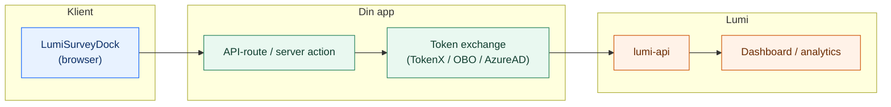

# Lumi


**Personvernvennlig survey-infrastruktur for NAV.**
Lumi lar deg samle brukerinnsikt uten at data forlater clusteret, med full støtte for Zero Trust og universell utforming.

Monorepo for Lumi survey analytics.

| Pakke | Beskrivelse | Tech Stack |
| :--- | :--- | :--- |
| [`@navikt/lumi-survey`](packages/lumi-survey) | React-widget (Aksel) | React, CSS Modules |
| [`lumi-api`](apps/lumi-api) | Backend & Analyse API | Kotlin, Ktor, Postgres |
| [`lumi-dashboard`](apps/lumi-dashboard) | Admin-dashboard | TanStack Start, React |

## Bruk survey-widgeten (lumi-survey)

For å komme i gang, følg “Kom i gang (30 sek)” i
[`packages/lumi-survey/README.md`](packages/lumi-survey/README.md).

Viktig: Widgeten skal **ikke** poste direkte til `lumi-api` fra browser. Token exchange må gjøres server-side.

## Arkitektur (1 minutt)



## Dokumentasjon

- Survey widget: [`packages/lumi-survey/README.md`](packages/lumi-survey/README.md)
- API og tilgang: [`apps/lumi-api/README.md`](apps/lumi-api/README.md)

### Integrasjon og tilgang (for team)

Lumi har egne endepunkter for innsending fra sluttbruker-flater (TokenX) og veileder/fagsystemer (AzureAD).

Viktig: Survey-widgeten skal **ikke** poste direkte til `lumi-api` fra browser. Token exchange må gjøres server-side. Typisk flyt er:

1. Widget sender payload til din app/backend (f.eks. server action / API-route)
2. Backend kan validere payload (valgfritt, men ofte lurt – f.eks. med Zod)
3. Backend gjør token exchange (TokenX eller AzureAD, avhengig av type flate)
4. Backend kaller `lumi-api`

### Slik integrerer du ("manuell" transport)

I NAV-økosystemet er det vanligst å implementere dette som en enkel server action / API-route i din app som:

1. Tar imot `submission.transportPayload` fra widgeten
2. (Valgfritt) validerer payload (f.eks. Zod)
3. Gjør token exchange og kaller `lumi-api`

Pseudo-kode (Next.js/Node-ish):

```ts
// 1) Client: widget transport
const transport = {
	async submit(submission) {
		await fetch("/api/lumi/feedback", {
			method: "POST",
			headers: { "content-type": "application/json" },
			body: JSON.stringify(submission.transportPayload),
		});
	},
};

// 2) Server: endepunkt som gjør token exchange + videresender
export async function POST(req: Request) {
	const payload = await req.json();

	// (Valgfritt) valider payload her
	// lumiSurveyTransportSchema.parse(payload)

	const accessToken = await exchangeTokenForLumiApi();

	const res = await fetch(`${process.env.LUMI_API_HOST}/api/tokenx/v1/feedback`, {
		method: "POST",
		headers: {
			"content-type": "application/json",
			authorization: `Bearer ${accessToken}`,
		},
		body: JSON.stringify(payload),
	});

	if (!res.ok) throw new Error("Failed to submit Lumi feedback");
	return new Response(await res.text(), { status: res.status });
}
```

`exchangeTokenForLumiApi()` er app-spesifikt (TokenX/OBO-løsning avhenger av stack). Poenget er at token exchange skjer server-side.

### Sluttbruker-flater (TokenX)

- Endepunkt: `POST /api/tokenx/v1/feedback`
- Auth: **TokenX**

Bruk dette for f.eks. innloggede sluttbruker-flater (arbeidsgiver/privatperson)

### Veileder / fagsystem (AzureAD)

- Endepunkt: `POST /api/azure/v1/feedback`
- Auth: **AzureAD**

Bruk dette for f.eks. Modia/veiledersystem.

### Tilgang (Zero Trust)

For at appen din skal kunne kalle Lumi API, må både appen din og `lumi-api` ha riktige NAIS tilgangspolicyer (inbound/outbound). Se mer detaljer i [`apps/lumi-api/README.md`](apps/lumi-api/README.md).

## Release

- `@navikt/lumi-survey`: se `packages/lumi-survey/CONTRIBUTING.md`
