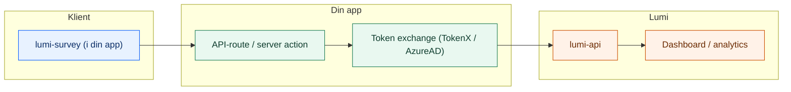

# Lumi


**Personvernvennlig survey-infrastruktur for NAV.**
Lumi lar deg samle brukerinnsikt uten at data forlater clusteret, med full støtte for Zero Trust og universell utforming.

| Pakke | Beskrivelse | Tech Stack |
| :--- | :--- | :--- |
| [`@navikt/lumi-survey`](packages/lumi-survey) | React-widget (Aksel) | React, CSS Modules |
| [`lumi-api`](apps/lumi-api) | Backend & Analyse API | Kotlin, Ktor, Postgres |
| [`lumi-dashboard`](apps/lumi-dashboard) | Admin-dashboard | TanStack Start, React |

## Arkitektur



## Kom i gang

### 1. Installer widgeten

`@navikt/lumi-survey` publiseres til GitHub Packages. Legg til dette i `.npmrc` i prosjektet ditt:

```properties
@navikt:registry=https://npm.pkg.github.com
```

Installer deretter:

```sh
npm install @navikt/lumi-survey @navikt/ds-react @navikt/ds-css
```

### 2. Importer CSS og render widgeten

```tsx
import "@navikt/ds-css";
import "@navikt/lumi-survey/styles.css";

import {
  LumiSurveyDock,
  DEFAULT_SURVEY_RATING,
  type LumiSurveyTransport,
} from "@navikt/lumi-survey";

const transport: LumiSurveyTransport = {
  async submit(submission) {
    await fetch("/api/lumi/feedback", {
      method: "POST",
      headers: { "content-type": "application/json" },
      body: JSON.stringify(submission.transportPayload),
    });
  },
};

export function App() {
  return (
    <LumiSurveyDock
      surveyId="min-app-tilbakemelding"
      survey={DEFAULT_SURVEY_RATING}
      transport={transport}
    />
  );
}
```

Widgeten har også ferdiglagde presets for andre survey-typer:

| Preset | Bruk |
| :--- | :--- |
| `DEFAULT_SURVEY_RATING` | Enkel puls-tilbakemelding (emoji/tommel/stjerner) |
| `DEFAULT_SURVEY_DISCOVERY` | Oppdagelsesundersøkelse |
| `DEFAULT_SURVEY_SERVICE_FEEDBACK` | Tjeneste-tilbakemelding |
| `createTopTasksSurvey(tasks)` | Top Tasks med egne oppgaver |
| `createTaskPrioritySurvey(tasks)` | Oppgaveprioritering |
| `createDiscoverySurvey(options)` | Tilpasset oppdagelsessurvey |

Se [`packages/lumi-survey/README.md`](packages/lumi-survey/README.md) for spørsmålstyper, progresjon, hendelser og fullstendige eksempler.

### 3. Sett opp backend (token exchange + forwarding)

Backend mottar `submission.transportPayload` fra frontend, gjør token exchange, og videresender til Lumi API. Velg endepunkt basert på flate-type:

| Flate | Auth | Endepunkt |
| :--- | :--- | :--- |
| **Sluttbruker** (nav.no innlogget, arbeidsgiver, privatperson) | TokenX | `POST /api/tokenx/v1/feedback` |
| **Intern** (Modia, veiledersystemer, fagsystemer) | AzureAD | `POST /api/azure/v1/feedback` |

Sett miljøvariabler i NAIS-manifestet. `LUMI_API_HOST` er påkrevd. For AzureAD (OBO) trenger du i tillegg lumi-api sin client ID på formatet `<cluster>.<namespace>.<app>`:

```yaml
spec:
  env:
    - name: LUMI_API_HOST
      value: http://lumi-api.team-esyfo
    # Kun for AzureAD OBO — brukes som scope/audience ved token exchange
    - name: LUMI_API_AAD_APP_CLIENT_ID
      value: "<cluster>.team-esyfo.lumi-api"   # f.eks. dev-gcp.team-esyfo.lumi-api
```

Du må også aktivere riktig auth i appen din i NAIS (avhengig av flate):

```yaml
# Sluttbrukerflate (TokenX)
spec:
  tokenx:
    enabled: true
```

```yaml
# Intern flate (AzureAD)
spec:
  azure:
    application:
      enabled: true
```

```ts
// Server-side pseudokode (din app)
const payload = await req.json();
const token = await exchangeToken(); // TokenX eller AzureAD avhengig av flate

await fetch(`${process.env.LUMI_API_HOST}/api/tokenx/v1/feedback`, {
  method: "POST",
  headers: {
    authorization: `Bearer ${token}`,
    "content-type": "application/json",
  },
  body: JSON.stringify(payload),
});
```

<details>
<summary><strong>Eksempel: Sluttbrukerflate (TokenX)</strong></summary>

For innloggede sluttbruker-flater (nav.no, arbeidsgiver/privatperson):

```ts
const payload = await req.json();
const token = await tokenxExchangeFor("lumi-api");

await fetch(`${process.env.LUMI_API_HOST}/api/tokenx/v1/feedback`, {
  method: "POST",
  headers: {
    authorization: `Bearer ${token}`,
    "content-type": "application/json",
  },
  body: JSON.stringify(payload),
});
```

</details>

<details>
<summary><strong>Eksempel: Intern flate (AzureAD / Modia)</strong></summary>

For veileder-/fagsystem-flater (Modia, interne verktøy):

```ts
const payload = await req.json();
const token = await azureOboFor("lumi-api");

await fetch(`${process.env.LUMI_API_HOST}/api/azure/v1/feedback`, {
  method: "POST",
  headers: {
    authorization: `Bearer ${token}`,
    "content-type": "application/json",
  },
  body: JSON.stringify(payload),
});
```

</details>

### 4. Sett opp NAIS-tilgang

Begge parter må konfigurere tilgangspolicyer (Zero Trust):

**Din app** (outbound):

```yaml
spec:
  accessPolicy:
    outbound:
      rules:
        - application: lumi-api
          namespace: team-esyfo
```

**Lumi API** (inbound) — opprett en issue i dette repoet eller lag en PR som legger til din app:

```yaml
spec:
  accessPolicy:
    inbound:
      rules:
        - application: din-app
          namespace: ditt-team
```

Se [`apps/lumi-api/README.md`](apps/lumi-api/README.md) for detaljer om API-endepunkter, query-parametre og dashboard-tilgang.

### 5. Storage-strategi

Widgeten kan persistere "dismissed"-tilstand. Velg strategi basert på flate:

| Flate | Strategi | Merknad |
| :--- | :--- | :--- |
| Sluttbruker (nav.no) | `consent` (default) | Krever `@navikt/nav-dekoratoren-moduler` |
| Intern (Modia, fagsystemer) | `localStorage` | Ingen ekstra avhengigheter |
| Ingen persistering | `none` | Surveyen vises hver gang |

> ⚠️ **Interne flater (Modia o.l.):** Default er `consent`, som krever NAV-dekoratørens consent-API. Uten dekoratøren vil widgeten ikke huske at brukeren har lukket surveyen. Sett `storageStrategy: "localStorage"`.

```tsx
<LumiSurveyDock behavior={{ storageStrategy: "localStorage" }} />
```

Se [survey-README → Storage-strategi](packages/lumi-survey/README.md#storage-strategi) for detaljer.

## Dokumentasjon

- Survey-widget (presets, spørsmålstyper, progresjon, events): [`packages/lumi-survey/README.md`](packages/lumi-survey/README.md)
- API-endepunkter, query-parametre, dashboard-tilgang: [`apps/lumi-api/README.md`](apps/lumi-api/README.md)
- Utvikling av Lumi (scripts, MCP, release): [`docs/DEVELOPMENT.md`](docs/DEVELOPMENT.md)
- Sikkerhet og pentest: [`docs/security/`](docs/security/)
- OpenAPI (utkast): [`docs/openapi/lumi-api.yaml`](docs/openapi/lumi-api.yaml)
