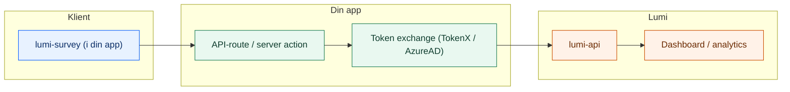

# Lumi


**Personvernvennlig survey-infrastruktur for NAV.**
Lumi lar deg samle brukerinnsikt uten at data forlater clusteret, med full støtte for Zero Trust og universell utforming.

| Pakke | Beskrivelse | Tech Stack |
| :--- | :--- | :--- |
| [`@navikt/lumi-survey`](packages/lumi-survey) | React-widget (Aksel) | React, CSS Modules |
| [`lumi-api`](apps/lumi-api) | Backend & Analyse API | Kotlin, Ktor, Postgres |
| [`lumi-dashboard`](apps/lumi-dashboard) | Admin-dashboard | TanStack Start, React |

## Arkitektur



## Dokumentasjon

📖 **[navikt.github.io/lumi/](https://navikt.github.io/lumi/)** — Fullstendig integrasjonsguide, widget-referanse og dashboard-dokumentasjon.

### Hurtigstart

```bash
npm install @navikt/lumi-survey
```

Se [Kom i gang](https://navikt.github.io/lumi/kom-i-gang/hva-er-lumi) for komplett guide.

## Utvikling

Internt i repoet brukes `pnpm` for workspace-installasjon og scripts. Se [utviklerguiden](https://navikt.github.io/lumi/utvikling/bidra) for lokal utvikling og bidrag.
