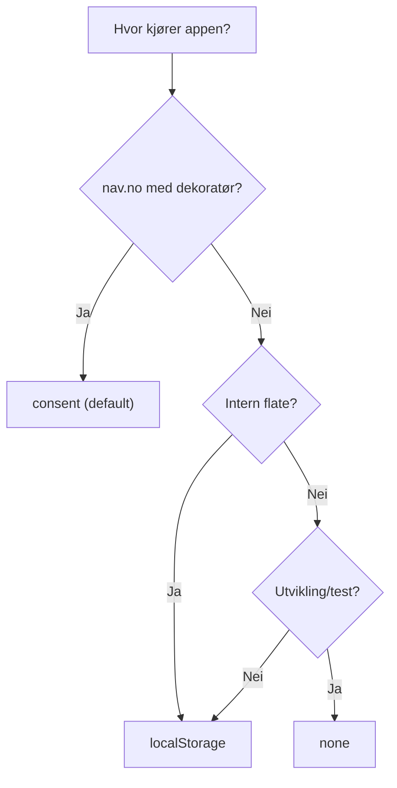

# Lagring

Widgeten husker at brukeren har lukket (dismissed) surveyen, og kan vente en cooldown-periode før den vises igjen. Du velger *hvordan* den husker dette med `storageStrategy`.

## Strategier

| Strategi | Flate | Avhengigheter | Merknad |
| :--- | :--- | :--- | :--- |
| `consent` (default) | Sluttbruker (nav.no) | Nav-dekoratørens consent-API | Respekterer brukerens samtykke |
| `localStorage` | Intern (Modia, fagsystemer) | Ingen | Lagrer direkte i localStorage |
| `none` | Alle | Ingen | Ingen persistering — surveyen vises hver gang |

## `consent` (default)

Default-strategien for nav.no-flater. Widgeten leser fra `window.__DECORATOR_DATA__` og bruker `window.webStorageController` som settes av Nav-dekoratøren. Ingen ekstra npm-pakke er nødvendig.

```tsx
<LumiSurveyDock
  surveyId="min-flate"
  survey={survey}
  transport={transport}
  // consent er default — trenger ikke spesifiseres
/>
```

::: warning Krever Nav-dekoratøren
`consent`-strategien fungerer kun på sider med Nav-dekoratøren (nav.no). Uten den kan ikke widgeten lagre dismissed-tilstand, og surveyen vil dukke opp igjen ved hver sidelast.
:::

Widgeten venter høyst 300 ms på den første consent-lesingen før den rendrer ut
fra `initialOpen`. Consent-oppslaget fortsetter i bakgrunnen: Hvis dekoratøren
blir klar senere, anvendes en lagret dismissal så lenge brukeren ikke allerede
har interagert med surveyen.

## `localStorage`

For interne flater (Modia, fagsystemer) som ikke har Nav-dekoratøren:

```tsx
<LumiSurveyDock
  surveyId="modia-tilbakemelding"
  survey={survey}
  transport={transport}
  behavior={{ storageStrategy: "localStorage" }}
/>
```

Dismissed-tilstanden lagres under en nøkkel basert på `surveyId` i `localStorage`.

## `none`

Ingen persistering — surveyen vises ved hver sidelast. Nyttig for utvikling eller one-shot-scenarioer:

```tsx
<LumiSurveyDock
  surveyId="test-survey"
  survey={survey}
  transport={transport}
  behavior={{ storageStrategy: "none" }}
/>
```

## Cooldown

Etter at brukeren lukker surveyen, venter widgeten en cooldown-periode før den vises igjen. Default er **30 dager**.

```tsx
<LumiSurveyDock
  surveyId="min-flate"
  survey={survey}
  transport={transport}
  behavior={{
    storageStrategy: "localStorage",
    dismissCooldownDays: 7, // Vis igjen etter 7 dager
  }}
/>
```

| Property | Type | Default | Beskrivelse |
| :--- | :--- | :--- | :--- |
| `storageStrategy` | `"consent" \| "localStorage" \| "none"` | `"consent"` | Hvordan dismissed-tilstand lagres |
| `dismissCooldownDays` | `number` | `30` | Dager før surveyen vises igjen etter dismiss |
| `hideAfterSubmit` | `boolean` | `true` | Skjul widgeten helt etter vellykket innsending |

## Velg riktig strategi



::: danger Vanlig feil på interne flater
Default er `consent`, som krever Nav consent API (`window.webStorageController`). Uten consent-API-et vil widgeten ikke kunne huske at brukeren lukket surveyen — den dukker opp igjen og igjen.

Fravær av consent-API blokkerer ikke widgeten i mer enn 300 ms, men det gir
fortsatt ingen persistering.

**Løsning:** Sett `storageStrategy: "localStorage"` for alle interne flater.

```tsx
<LumiSurveyDock behavior={{ storageStrategy: "localStorage" }} />
```
:::

## Events ved lagringsfeil

Hvis lagring feiler (f.eks. consent nektet), fyres `onDismissalPersistFailed`-eventet. Se [Events](/referanse/events) for detaljer.

```tsx
<LumiSurveyDock
  events={{
    onDismissalPersistFailed: (cause) => {
      console.warn("Kunne ikke lagre dismissed-tilstand:", cause);
    },
  }}
/>
```
