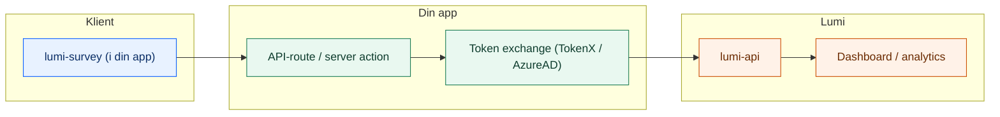

# Hva er Lumi?

Lumi er et verktøy for å kjøre personvernvennlige surveys i Nav-apper. Du definerer spørsmålene i TypeScript, widgeten kjører i din app, og all data forblir i Nav-clusteret.

## Hvorfor Lumi?

- **Survey as code** — definer spørsmål i TypeScript, rett i kodebasen din. Ingen ekstern tjeneste.
- **Privacy by design** — all data blir i Nav-clusteret, og personopplysninger maskeres automatisk.
- **Aksel-basert** — widgeten bruker Navs designsystem og følger WCAG.
- **Rask integrasjon** — installer en React-widget, koble til backend, ferdig.
- **Dashboard** — filtrer, segmenter og eksporter survey-data med teambasert tilgangsstyring.

## Arkitektur

Lumi består av tre deler: en frontend-widget som lever i *din* app, et API-lag som *du* eier (token exchange + videresending), og Lumi-plattformen som lagrer og visualiserer data.

## Pakkeoversikt

| Pakke | Beskrivelse | Tech Stack |
| :--- | :--- | :--- |
| [`@navikt/lumi-survey`](https://github.com/navikt/lumi/tree/main/packages/lumi-survey) | React-widget (Aksel) | React, CSS Modules |
| [`lumi-api`](https://github.com/navikt/lumi/tree/main/apps/lumi-api) | Backend & Analyse API | Kotlin, Ktor, Postgres |
| [`lumi-dashboard`](https://github.com/navikt/lumi/tree/main/apps/lumi-dashboard) | Admin-dashboard | TanStack Start, React |

Du trenger kun å forholde deg til **`@navikt/lumi-survey`** — de to andre pakkene driftes av Team eSyfo.

## Hvem er Lumi for?

Lumi er laget for **Nav-team som vil samle brukerinnsikt** i sine flater — enten det er en sluttbrukerflate på nav.no eller en intern løsning som Modia. Du trenger:

- En React-app som kjører på NAIS
- Mulighet til å gjøre token exchange (TokenX eller AzureAD) for å sende inn svar

## Neste steg

Klar til å komme i gang? Gå videre til [Installer widget](/kom-i-gang/installer-widget) for å sette opp pakken i prosjektet ditt.
