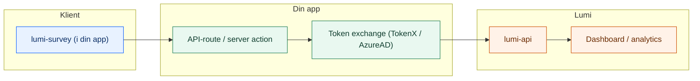

# Hva er Lumi?

Lumi er en personvernvennlig survey-infrastruktur for NAV. Den lar deg samle brukerinnsikt rett i din app — uten at data forlater clusteret, med full støtte for Zero Trust og universell utforming.

## Hvorfor Lumi?

- **Privacy by design** — all data blir i NAV-clusteret, og PII maskeres automatisk
- **Rask integrasjon** — installer en React-widget, koble til backend, ferdig
- **Aksel-basert** — widgeten bruker NAVs designsystem og følger WCAG
- **Dashboard** — filtrer, segmenter og eksporter survey-data med teambasert tilgangsstyring

## Arkitektur

Lumi består av tre deler: en frontend-widget som lever i *din* app, et API-lag som *du* eier (token exchange + videresending), og Lumi-plattformen som lagrer og visualiserer data.

## Pakkeoversikt

| Pakke | Beskrivelse | Tech Stack |
| :--- | :--- | :--- |
| [`@navikt/lumi-survey`](https://github.com/navikt/lumi/tree/main/packages/lumi-survey) | React-widget (Aksel) | React, CSS Modules |
| [`lumi-api`](https://github.com/navikt/lumi/tree/main/apps/lumi-api) | Backend & Analyse API | Kotlin, Ktor, Postgres |
| [`lumi-dashboard`](https://github.com/navikt/lumi/tree/main/apps/lumi-dashboard) | Admin-dashboard | TanStack Start, React |

Som integrator trenger du bare å forholde deg til **`@navikt/lumi-survey`** — de to andre pakkene driftes av Lumi-teamet.

## Hvem er Lumi for?

Lumi er laget for **NAV-team som vil samle brukerinnsikt** i sine flater — enten det er en sluttbrukerflate på nav.no eller et internt verktøy som Modia. Du trenger:

- En React-app (eller en app som kan rendre React-komponenter)
- En backend/API-route som kan gjøre token exchange (TokenX eller AzureAD)
- En app som kjører på NAIS

## Neste steg

Klar til å komme i gang? Gå videre til [Installer widget](/kom-i-gang/installer-widget) for å sette opp pakken i prosjektet ditt.
