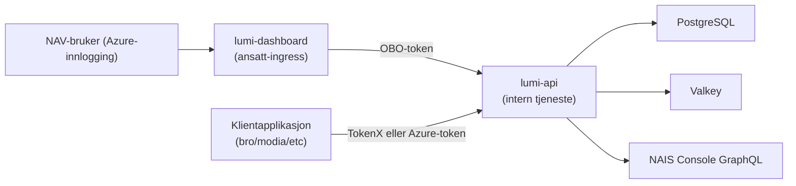

# Lumi – arkitektur og trust boundaries

## Overordnet flyt



## Trust boundaries

### 1. Internett-boundary (dashboard)

Eksponert komponent: `lumi-dashboard` på `.ansatt.*`

| Kontroll         | Implementasjon                                                                                                |
|------------------|---------------------------------------------------------------------------------------------------------------|
| Autentisering    | Microsoft Entra ID (Azure AD) sidecar (Wonderwall) med autoLogin                                              |
| CSP              | Content Security Policy (CSP): per-request nonce + SHA256-hash, `object-src 'none'`, `frame-ancestors 'none'` |
| CSRF             | Cross-Site Request Forgery (CSRF): Origin/Referer-validering for non-GET metoder                              |
| SRI              | Subresource Integrity (SRI): SHA384-hashes for bundlede JS/CSS-assets                                         |
| Security headers | X-Content-Type-Options, X-Frame-Options (DENY), Referrer-Policy, Permissions-Policy                           |
| Input-validering | Zod-schemas for alle server-funksjoner                                                                        |

### 2. Intern service-boundary (API)

`lumi-api` har ingen ingress, kun intern service discovery.

| Kontroll            | Implementasjon                                                                          |
|---------------------|-----------------------------------------------------------------------------------------|
| Network policy      | NAIS inbound-regler (5 autoriserte apper)                                               |
| Token-validering    | Texas sidecar introspection (ikke egenmontert JSON Web Token (JWT)-validering)          |
| Client-autorisasjon | ClientAuthorizationPlugin – kun lumi-dashboard for analyse-ruter                        |
| Team-autorisasjon   | TeamAuthorizationPlugin – NAIS Console GraphQL brukeroppslag                            |
| Database-scoping    | Alle queries filtrerer på `team = ?` (validert server-side)                             |
| Security headers    | X-Content-Type-Options, X-Frame-Options, Referrer-Policy, Permissions-Policy            |
| CORS                | Cross-Origin Resource Sharing (CORS): eksplisitt origin-whitelist, credentials disabled |

### 3. Submission-boundary

Issuer-spesifikke endepunkter (`/api/tokenx/`, `/api/azure/`).

| Kontroll         | Implementasjon                                                                                                                                                                                                                                                   |
|------------------|------------------------------------------------------------------------------------------------------------------------------------------------------------------------------------------------------------------------------------------------------------------|
| Token-validering | Texas introspection per request (TokenX eller Azure AD)                                                                                                                                                                                                          |
| Caller identity  | Utledes fra validerte token-claims (`client_id` / `azp_name`), ikke bruker-input                                                                                                                                                                                 |
| Rate limiting    | 100 req/min per kaller-app                                                                                                                                                                                                                                       |
| Payload-grense   | Maks 1 MB                                                                                                                                                                                                                                                        |
| Input-validering | Streng JSON-parsing (`ignoreUnknownKeys=false`), typed validation per felttype                                                                                                                                                                                   |
| PII-redaksjon    | 13 mønstertyper (se `SensitiveDataPatterns.ALL_PATTERNS` i [`apps/lumi-api/src/main/kotlin/no/nav/lumi/sensitive/SensitiveDataPatterns.kt`](../../apps/lumi-api/src/main/kotlin/no/nav/lumi/sensitive/SensitiveDataPatterns.kt)), redaksjon ved lagring + lesing |

### 4. Team-data-boundary

Analyse-ruter under `/api/v1/intern/*` bruker team-autorisasjon.

| Kontroll     | Implementasjon                                                                                 |
|--------------|------------------------------------------------------------------------------------------------|
| Team-oppslag | NAIS Console GraphQL API (dynamisk, ikke hardkodet)                                            |
| Cache        | Valkey med TTL (1t når team finnes, 5min når oppslag returnerer ingen team, 30s ved NAIS-feil) |
| Fail closed  | NAIS API nede → 503 (ingen data lekker)                                                        |
| Query-scope  | `call.authorizedTeam` brukes i alle database-queries                                           |

## Autorisasjonslag for analyse-ruter

```
1. Azure-autentisering (authenticate(AZURE_REALM))
       ↓
2. Client-autorisasjon (tillatt dashboard client-id)
       ↓
3. Team-autorisasjon (NAIS GraphQL bruker/team-oppslag)
       ↓
4. Team-scopet datalesing/-skriving i backend
```

Alle lag må passere for tilgang til data.

## Rate limiting

| Kategori   | Grense       | Nøkkel                              |
|------------|--------------|-------------------------------------|
| Submission | 100 req/min  | CallerIdentity (team:app fra token) |
| Analytics  | 300 req/min  | CallerIdentity → ClientId → IP      |
| Export     | 30 req/min   | CallerIdentity → ClientId → IP      |
| Global     | 1000 req/min | Alle kall samlet                    |

## Operasjonelle endepunkter

**lumi-api:**
- `GET /internal/isAlive`
- `GET /internal/isReady`
- `GET /internal/prometheus`

**lumi-dashboard:**
- `GET /api/internal/isAlive`
- `GET /api/internal/isReady`
- `GET /api/internal/metrics`

Disse er ment for plattform-health og monitorering, og krever ingen autentisering.
