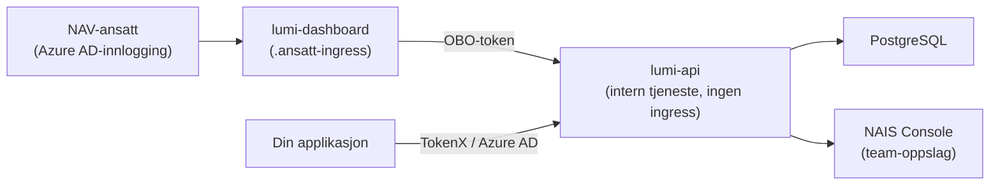

# Sikkerhetsarkitektur

Lumi er designet med gjennomgående sikkerhet — fra innsamling av tilbakemeldinger til visning i dashboardet. Denne siden gir en oversikt over hvordan data beskyttes.

## Overordnet arkitektur



Dataflyt går kun innover — `lumi-api` har ingen offentlig ingress og er kun tilgjengelig via NAIS intern service discovery.

## Trust boundaries

Lumi har fire distinkte sikkerhetsgrenser som beskytter data i ulike lag.

### 1. Internett-grensen (dashboard)

Dashboardet er den eneste komponenten eksponert mot internett, via `.ansatt.*`-ingresser.

| Kontroll | Beskrivelse |
| :--- | :--- |
| Autentisering | Azure AD via Wonderwall-sidecar med autoLogin |
| CSP | Content Security Policy med per-request nonce og SHA256-hash |
| CSRF-beskyttelse | Origin/Referer-validering for alle muterende forespørsler |
| SRI | Subresource Integrity-hashes for alle bundlede assets |
| Security headers | X-Content-Type-Options, X-Frame-Options (DENY), Referrer-Policy, Permissions-Policy |
| Input-validering | Zod-schemas for alle server-funksjoner |

### 2. Intern service-grensen (API)

`lumi-api` har ingen ingress — den er kun tilgjengelig internt i clusteret.

| Kontroll | Beskrivelse |
| :--- | :--- |
| Nettverkspolicy | NAIS inbound-regler begrenser hvilke apper som kan kalle API-et |
| Token-validering | Texas sidecar-introspection for alle forespørsler |
| Client-autorisasjon | Kun dashboardet har tilgang til analyse-ruter |
| Team-autorisasjon | Brukerens teammedlemskap verifiseres via NAIS Console |
| Database-scoping | Alle queries filtrerer på validert team |

### 3. Innsendingsgrensen

Klientapplikasjoner sender inn tilbakemeldinger via issuer-spesifikke endepunkter.

| Kontroll | Beskrivelse |
| :--- | :--- |
| Token-validering | Texas introspection per request (TokenX eller Azure AD) |
| Caller identity | Utledes fra validerte token-claims, ikke bruker-input |
| Rate limiting | 100 forespørsler per minutt per kaller-app |
| Payload-grense | Maks 1 MB |
| Input-validering | Streng JSON-parsing med typet validering per felttype |
| PII-redaksjon | Automatisk maskering ved lagring (se under) |

### 4. Team-datagrensen

Analyse-ruter under `/api/v1/intern/*` er strengt scopet til brukerens team.

| Kontroll | Beskrivelse |
| :--- | :--- |
| Team-oppslag | Dynamisk oppslag via NAIS Console GraphQL API |
| Fail closed | NAIS API nede → 503 (ingen data lekker) |
| Query-scope | `call.authorizedTeam` brukes i alle database-queries |

## Autorisasjonslag

For å få tilgang til data i analyse-rutene må alle fire lag passere:

```
1. Azure AD-autentisering (gyldig token)
       ↓
2. Client-autorisasjon (tillatt klient-ID)
       ↓
3. Team-autorisasjon (NAIS team-oppslag)
       ↓
4. Team-scopet datalesing i database
```

Hvis ett lag feiler, avbrytes forespørselen — ingen delvis tilgang.

## PII-maskering {#pii-maskering}

API-et maskerer automatisk personlig identifiserbar informasjon (PII) i fritekst-svar. Maskering skjer **ved lagring**, slik at sensitive data aldri finnes i klartekst i databasen.

| Mønster | Eksempel | Erstatning |
| :--- | :--- | :--- |
| Fødselsnummer | `12345678901` | `[FØDSELSNUMMER FJERNET]` |
| NAV-ident | `A123456` | `[NAVIDENT FJERNET]` |
| E-post | `test@nav.no` | `[E-POST FJERNET]` |
| Telefonnummer | `12345678` | `[TELEFON FJERNET]` |
| Kortnummer | `1234 5678 9012 3456` | `[KORTNUMMER FJERNET]` |
| Kontonummer | `1234.56.12345` | `[KONTONUMMER FJERNET]` |
| Hemmelig adresse | «hemmelig adresse» | `[HEMMELIG ADRESSE]` |

::: info Dobbel maskering
PII-redaksjon kjøres både ved lagring og ved lesing. Selv om et mønster slipper gjennom ved lagring, fanges det ved visning.
:::

## Rate limiting

API-et håndhever rate limiting på flere nivåer for å beskytte mot misbruk:

| Kategori | Grense | Beskrivelse |
| :--- | :--- | :--- |
| Innsending | 100 req/min | Per kaller-app |
| Analyse | 300 req/min | Per bruker |
| Eksport | 30 req/min | Per bruker |
| Global | 1000 req/min | Alle kall samlet |

## Se også

- [Tilgang](/dashboard/tilgang) — hvem som har tilgang til dashboardet
- [Datakontrakt](/referanse/datakontrakt) — payload-struktur og input-validering
